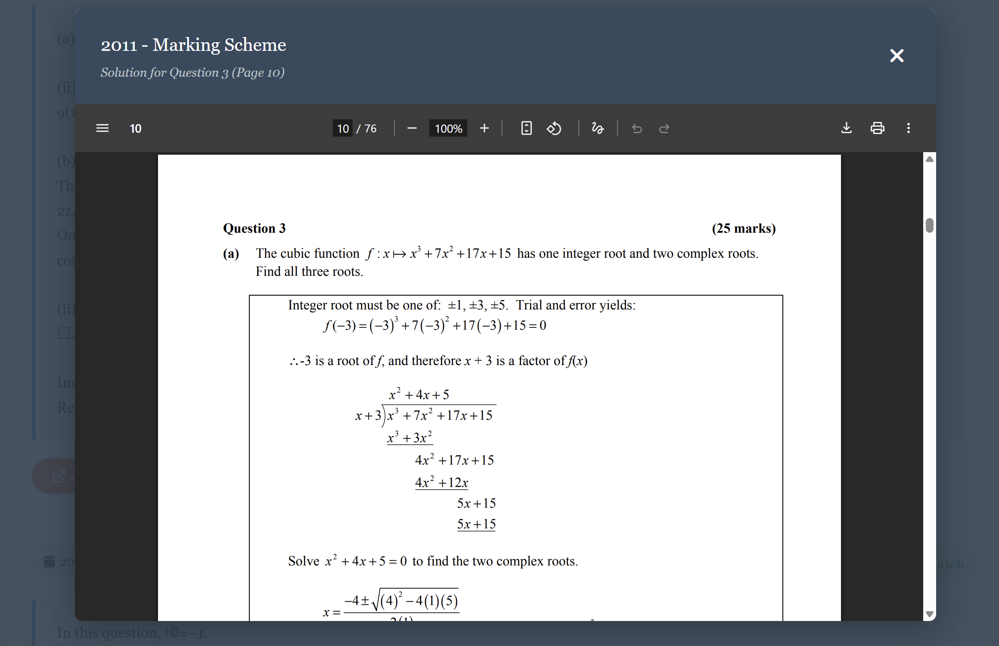

Something cooked up very quickly to let me look up past papers and marking schemes using natural language.

Works surprisingly well in my opinion.

# Example

```
python app.py
```

Visit http://localhost:5000/ (or whatever port it tells you to)

Type in whatever topic you want questions on


